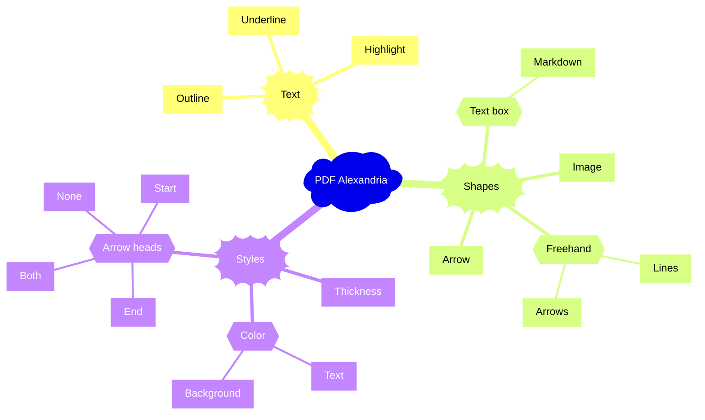

# pdfalexandria

PDF Alexandria (after the famous library) is a PDF annotation application written in Qt/QML.

```mermaid
mindmap
  root)PDF Alexandria(
    id))Text((
      id[Highlight]
      id[Outline]
      id[Underline]
    id))Shapes((
      id{{Text box}}
        id[Markdown]
      id[Arrow]
      id[Image]
      id{{Freehand}}
        id[Lines]
        id[Arrows]
    id))Styles((
      id{{Color}}
        id[Background]
        id[Text]
      id[Thickness]
      id{{Arrow heads}}
        id[Start]
        id[End]
        id[Both]
        id[None]
```
