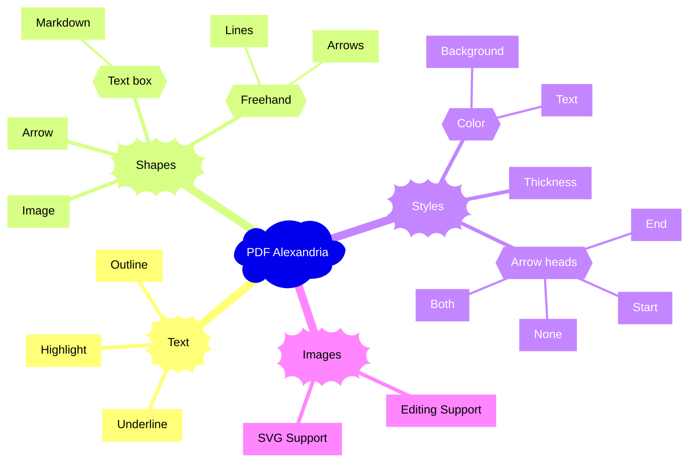
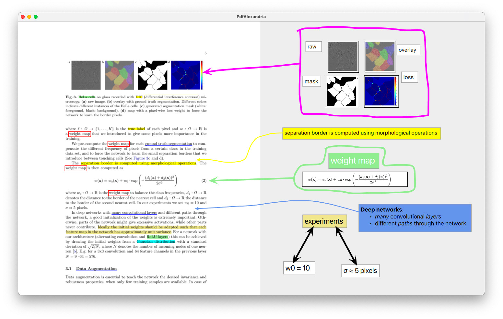

# PDF Alexandria

Download: [Windows](https://github.com/sadaszewski/pdfalexandria/releases/download/2024c/pdf-alexandria-2024c-windows-x64.zip) | [MacOS](https://github.com/sadaszewski/pdfalexandria/releases/download/2024b/pdf-alexandria-2024b-macos-x64.zip)

PDF Alexandria (after the famous library) is a PDF annotation application written in Qt/QML. The features of PDFA are illustrated on the following mind map and screenshots. The user interface is minimalistic and works by dragging and clicking with your mouse/touch pad. In order to add a *text box*, select some text from the PDF page on the left and drag it into the annotation space on the right. To draw an *arrow*, click and drag in empty annotation space. To add an *image*, draw a selection rectangle on the PDF page (the starting and ending point must not contain text in order for the gesture to be recognized as image capture). To draw a *freehand line* or *arrow*, right click in empty annotation space and switch drawing mode to Freehand in the popup menu. Then proceed to click and drag in the annotation space. To *highlight/outline/underline* text on the PDF page - select it, right-click it and select the desired *highlight*, *outline* or *underline* color from the popup menu. Text annotations can be deleted by right-clicking them and selecting Delete from a popup menu. Other annotations can be moved and scaled using standard mouse/touch pad actions. *Arrows* can be dragged by their ends or by the middle part. Freehand shapes currently cannot be scaled or edited. Shapes can be reconfigured and/or deleted by right-clicking them and using appropriate options from the resulting popups. Changes are saved automatically and instantenously - you can close and re-open the PDF and your annotations will be there. Changes are saved to a separate sidecar file - the PDF file is never modified. Use Ctrl/Command + scroll wheel to zoom. On Windows, make sure to install `vc_redist.x64.exe` (included in the archive) if the application does not start. A shoutout to some famous annotation apps which definitely have their merits - [Xournalpp](https://xournalpp.github.io/), [LiquidText](https://www.liquidtext.net/), [Samsung Notes](https://play.google.com/store/apps/details?id=com.samsung.android.app.notes), [Noteful](https://apps.apple.com/us/app/noteful-note-taking-on-pdf/id1587904334), [Apple Notes](https://apps.apple.com/us/app/notes/id1110145109), [GoodNotes](https://apps.apple.com/us/app/goodnotes-6/id1444383602), [OneNote](https://www.onenote.com/).

Watch the video:

<a href="https://www.youtube.com/watch?v=T5Id_scj1Ho" target="_blank">]</a>

